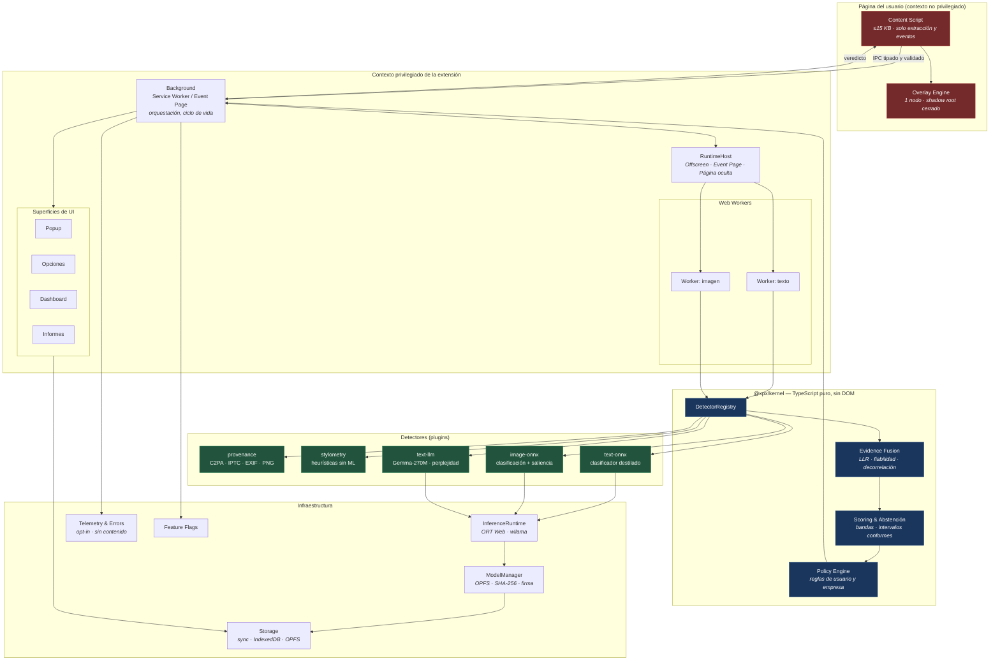
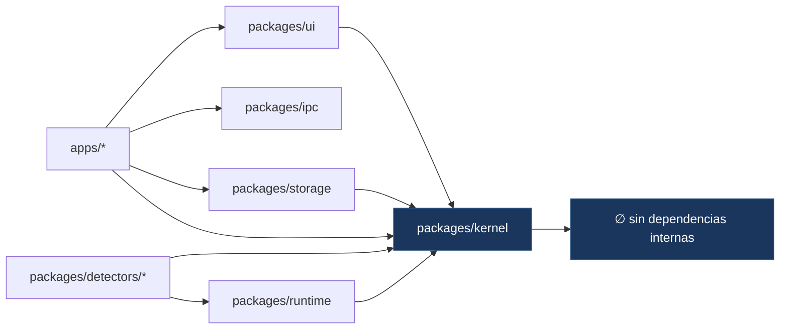
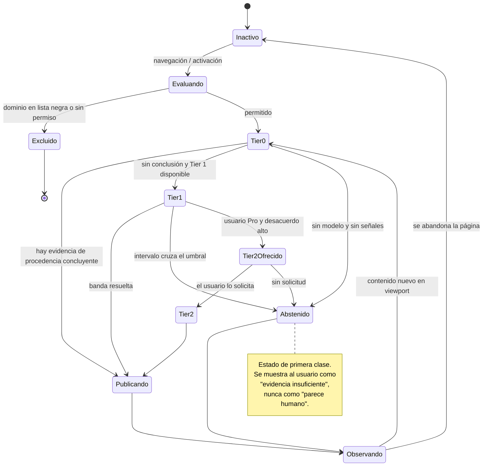
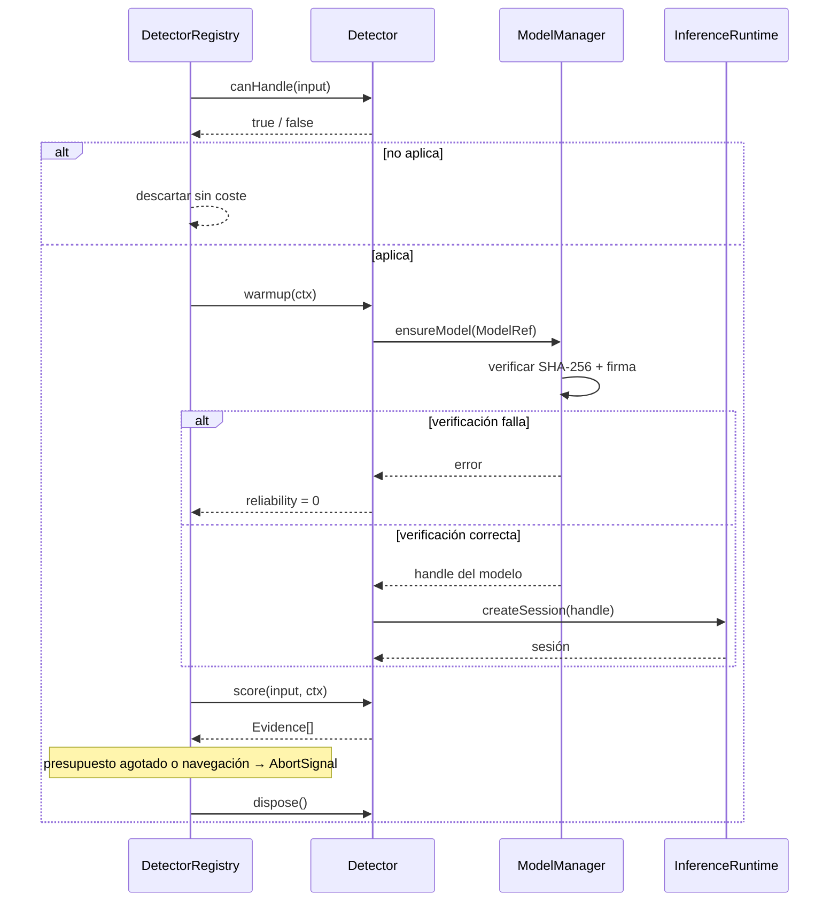

# 04 · Diagrama de componentes

## 1. Vista general

Lectura del diagrama en una frase: **el contexto rojo no tiene privilegios y no ejecuta modelos;
el contexto azul no sabe qué navegador lo hospeda; el verde es reemplazable sin tocar nada más.**

---

## 2. Responsabilidades y fronteras

| Componente | Hace | **No hace** |
|---|---|---|
| **Content Script** | Extrae bloques de texto e imágenes visibles, normaliza, observa el viewport, pinta el overlay | Inferencia. Acceso al historial. Red. Decisiones de política |
| **Overlay Engine** | Dibuja capas dentro de un shadow root cerrado, reposiciona, limpia | Modificar el DOM del host. Inyectar estilos globales |
| **Background** | Orquesta, enruta IPC, gestiona ciclo de vida, aplica política | Inferencia pesada (delega en RuntimeHost) |
| **RuntimeHost** | Aloja Workers y el runtime de inferencia con vida larga | Lógica de negocio. Conocer detectores concretos |
| **DetectorRegistry** | Descubre, filtra por `canHandle`, planifica por tier y presupuesto | Interpretar resultados |
| **Evidence Fusion** | Combina LLR ponderados por fiabilidad, decorrelaciona | Decidir qué mostrar |
| **Scoring** | Bandas, intervalos conformes, abstención | Formatear texto de UI |
| **Policy Engine** | Reglas de usuario y de empresa: umbrales, dominios, acciones | Persistir. Renderizar |
| **ModelManager** | Descarga, verifica hash y firma, versiona, hace rollback | Ejecutar inferencia |
| **Telemetry** | Métricas anónimas de rendimiento y calidad, opt-in | Ver contenido. Identificar usuarios o URLs |

---

## 3. Grafo de dependencias permitido

Reglas impuestas por `eslint-plugin-boundaries` y verificadas en CI:

1. `kernel` no importa de ningún otro paquete interno. Cero excepciones.
2. `detectors/*` no importa de `ui`, `storage` ni `apps`.
3. `apps/extension` es el único lugar donde puede aparecer `chrome.*` o `browser.*`.
4. `ui` no importa de `detectors` ni de `runtime`.

Una violación rompe el build. Este es el mecanismo que impide que el monolito reaparezca por
acumulación de atajos.

---

## 4. Máquina de estados del análisis de página

`Tier2Ofrecido` es deliberado: el motor caro **nunca se dispara solo**. Protege batería, memoria
y la percepción de que la extensión "pesa".

---

## 5. Ciclo de vida de un detector

---

## 6. Superficies de UI

| Superficie | Propósito | Estado en MVP |
|---|---|---|
| **Overlay** | Evidencia en contexto: subrayado, tooltip, capa sobre imagen | Sí |
| **Popup** | Trust Score de la página, switches de texto e imagen, acción rápida | Sí |
| **Opciones** | Sensibilidad, idioma, atajos, tema, listas, modelo, actualizaciones | Sí |
| **Dashboard** | Historial, estadísticas, gráficos, dominios, exportación | Parcial |
| **Informes** | Exportable PDF/JSON con evidencias, para periodismo y peritaje | V1 |
| **Modo desarrollador** | Tiempos de inferencia, LLR por detector, modelo, calibración | Sí, oculto |

El modo desarrollador entra en el MVP a propósito: es el instrumento con el que se depura la
calibración, y su coste es bajo porque los datos ya existen en el objeto `Evidence`.
