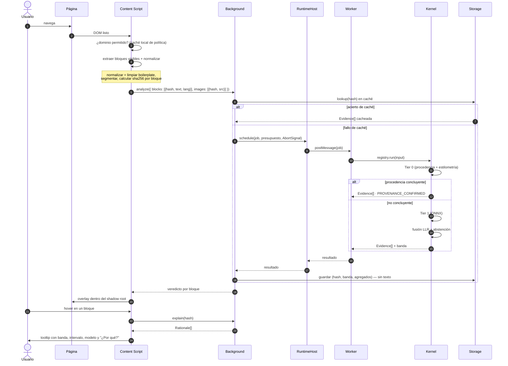
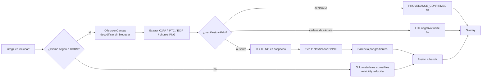

# 05 · Flujo de datos

## 1. Regla de frontera

Solo tres tipos de datos cruzan la frontera del dispositivo, y los tres son opcionales:

| Sale del dispositivo | Cuándo | Contiene contenido del usuario |
|---|---|---|
| Descarga de modelos | Al activar un tier | No. Tráfico unidireccional hacia el CDN |
| Telemetría | Solo con opt-in explícito | **No.** Métricas agregadas, sin URL ni texto |
| Informe compartido | Solo si el usuario pulsa "compartir" | Sí, lo que él seleccionó, y lo sabe |

Todo lo demás permanece local. Esto no es una preferencia: es la restricción de diseño de la que
depende la propuesta de valor entera.

---

## 2. Flujo principal: análisis de una página



Puntos donde se cancela el trabajo: el usuario navega, el bloque sale del viewport antes de
empezar, el presupuesto de página se agota, o el sistema detecta contención de CPU. Todos se
propagan con un único `AbortSignal` por página.

---

## 3. Normalización antes de cruzar cualquier frontera

El content script no envía el DOM. Envía una estructura mínima:

```ts
interface NormalizedInput {
  hash: string;              // sha256 del texto normalizado
  modality: Modality;
  text?: string;             // sin boilerplate, sin navegación, sin anuncios
  imageRef?: { hash: string; bitmap: ImageBitmap };
  lang: string;              // detectado localmente
  tokenCount: number;
  domHints: {                // señales estructurales baratas
    isArticle: boolean;
    isUserGenerated: boolean;
    platformLabel?: string;  // etiqueta de IA declarada por la plataforma
  };
}
```

`hash` es la clave de caché y **la única cosa que se persiste** junto al resultado. El campo
`text` vive en memoria durante la petición y se descarta.

---

## 4. Flujo de imagen



Dos detalles de ingeniería que evitan problemas reales:

- La decodificación va a **OffscreenCanvas** dentro del Worker. Decodificar en el hilo principal
  de la página es la forma más rápida de arruinar el scroll en una galería.
- Imágenes cross-origin sin CORS no se pueden leer píxel a píxel. En ese caso el sistema **lo
  dice** ("análisis limitado a metadatos") en lugar de fingir un resultado con menos información.

---

## 5. Flujo de descarga y verificación de modelos

```mermaid
sequenceDiagram
    participant U as Usuario
    participant OPT as Opciones
    participant MM as ModelManager
    participant CDN as CDN de modelos
    participant OPFS as OPFS

    U->>OPT: activar análisis de texto
    OPT->>MM: ensure('text-clf-multiling')
    MM->>OPFS: ¿instalado y verificado?
    alt ya presente
        OPFS-->>MM: handle
    else ausente
        MM->>U: "Se descargarán 48 MB. ¿Continuar?"
        U-->>MM: sí
        MM->>CDN: GET manifest.json
        CDN-->>MM: manifiesto firmado
        MM->>MM: verificar firma del manifiesto
        MM->>CDN: GET ficheros (reanudable, por trozos)
        loop por fichero
            MM->>MM: SHA-256
            alt hash no coincide
                MM->>MM: abortar y purgar
                MM->>U: error, sin instalar
            end
        end
        MM->>OPFS: escribir + registrar calibrationId
    end
    MM-->>OPT: listo
```

La descarga se anuncia con su tamaño **antes** de empezar. Un producto que consume 48 MB sin
avisar pierde la confianza que dice vender.

---

## 6. Telemetría — qué se envía exactamente

Opt-in, desactivada por defecto, revocable, y con vista previa del payload en Opciones.

```jsonc
{
  "schema": "xpx.telemetry.v1",
  "installBucket": "2026-w32",     // cohorte semanal, no ID de instalación
  "appVersion": "1.2.0",
  "platform": "chromium",
  "event": "analysis_completed",
  "tier": 1,
  "modelId": "text-clf-multiling",
  "modelVersion": "0.4.1",
  "calibrationId": "cal-2026-07",
  "latencyMsP50": 82,
  "latencyMsP95": 240,
  "band": "WEAK_SIGNAL",
  "abstained": false,
  "langBucket": "es",
  "deviceTier": "mid"
}
```

Lo que **nunca** aparece en el payload, verificado por test automatizado en CI que falla si un
campo prohibido se cuela:

- URL, dominio o cualquier derivado (ni siquiera hasheado — un dominio hasheado es reversible por
  fuerza bruta sobre una lista de dominios conocidos).
- Texto, fragmentos de texto, hashes de contenido.
- Imágenes o sus hashes.
- Identificador estable de usuario o de instalación.
- Dirección IP conservada: el endpoint la descarta antes de persistir.

El "sistema de reputación de dominios" del brief **no puede construirse con esta telemetría**, y
esa es la decisión correcta. Se construye con un rastreador propio sobre páginas públicas, no con
los hábitos de navegación de los usuarios. Detalle en
[`09-riesgos-privacidad.md`](./09-riesgos-privacidad.md#5-reputación-de-dominios-sin-vigilar-a-nadie).

---

## 7. Retención local

| Dato | Retención por defecto | Configurable |
|---|---|---|
| Caché de resultados | 7 días o 5.000 entradas (LRU) | Sí |
| Historial del dashboard | 90 días, solo agregados | Sí, incluido "no guardar nada" |
| Informes guardados | Hasta borrado manual | — |
| Modelos | Hasta desinstalación o purga manual | Sí |
| Logs de error | 30 días, locales, sin enviar salvo opt-in | Sí |

"Borrar todos mis datos" en Opciones vacía IndexedDB, OPFS y `storage`, y es una sola acción sin
diálogos de retención. También se ofrece un modo incógnito propio: analizar sin escribir nada.

---

## 8. Modo offline

Sin conexión, con modelos ya instalados, sigue funcionando: Tier 0 completo, Tier 1 completo,
Tier 2 si estaba descargado, overlay, popup, dashboard, historial, informes y exportación. Se
degradan únicamente: la comprobación de actualizaciones y el envío de telemetría, que se encola
y caduca a los 7 días si nunca hay red.

Esto es consecuencia directa de la arquitectura local; no requiere trabajo específico más allá de
no introducir dependencias de red en rutas críticas. Se verifica con un test E2E que corre con la
red bloqueada.
