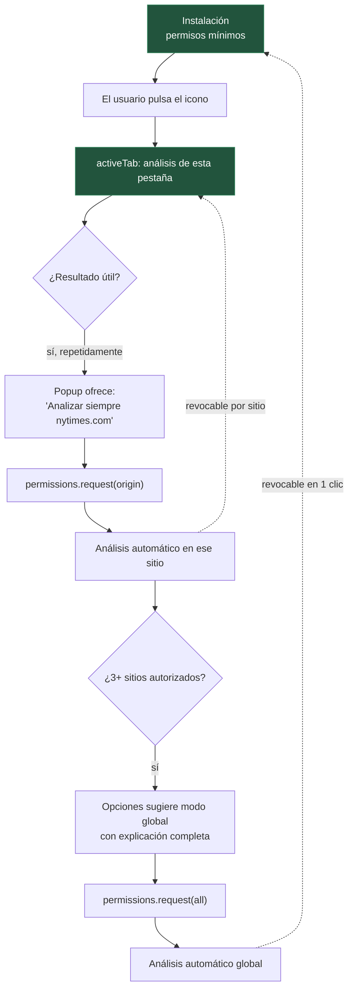

# 06 · Modelo de permisos

## 1. La decisión que define el producto

**No se pide `<all_urls>` en la instalación.**

Es tentador pedirlo: simplifica el código y permite analizar todo automáticamente desde el primer
segundo. También produce el aviso de instalación más agresivo que existe —*"Leer y cambiar todos
tus datos en todos los sitios web"*— en un producto cuyo argumento central es la privacidad. La
contradicción sería fatal, y además dispara revisión manual prolongada en las cinco tiendas.

Modelo adoptado: **escalada progresiva de permisos**. El usuario concede acceso al ámbito que
quiere, cuando lo quiere, y lo ve.

---

## 2. Permisos en la instalación

```jsonc
{
  "permissions": [
    "storage",        // ajustes, historial, caché
    "activeTab",      // acceso a la pestaña actual solo tras acción del usuario
    "scripting",      // inyección programática, solo donde hay permiso
    "offscreen"       // solo Chromium; host de inferencia
  ],
  "optional_permissions": [
    "tabs",           // solo si el usuario activa el análisis automático
    "unlimitedStorage" // solo si instala Tier 2
  ],
  "host_permissions": [],
  "optional_host_permissions": [
    "http://*/*",
    "https://*/*"
  ]
}
```

Ningún `host_permissions` en la instalación. El aviso que ve el usuario al instalar es mínimo, y
eso es una ventaja de conversión medible además de una postura ética.

---

## 3. Los tres niveles de acceso

| Nivel | Qué concede el usuario | Cómo lo concede | Qué obtiene |
|---|---|---|---|
| **1 · Bajo demanda** | Nada persistente | Pulsa el icono de la extensión | Análisis de la pestaña actual, esta vez. `activeTab` caduca al navegar |
| **2 · Por sitio** | Permiso de host para un origen | "Analizar siempre este sitio" en el popup | Análisis automático en ese dominio, para siempre o hasta revocar |
| **3 · Global** | `http://*/*` + `https://*/*` + `tabs` | Interruptor explícito en Opciones, con explicación de qué implica | Análisis automático en toda la web |

El nivel 1 es el estado inicial y **es un producto completo por sí mismo**. El brief pide análisis
automático de las páginas visitadas; eso es el nivel 2 o 3, y se alcanza cuando el usuario ya
confía en la herramienta, no antes de haberla probado.

La escalada se solicita con `permissions.request()` desde un gesto del usuario, nunca de forma
programática al arrancar.

---

## 4. Justificación de cada permiso

Este cuadro es literalmente el texto que va en las fichas de las tiendas. Las cinco lo exigen y
la falta de justificación específica es una causa habitual de rechazo.

| Permiso | Justificación |
|---|---|
| `storage` | Guardar ajustes, historial local y caché de resultados. Ningún dato sale del dispositivo |
| `activeTab` | Analizar la página actual cuando el usuario pulsa el icono. Sin acceso persistente |
| `scripting` | Inyectar el analizador solo en páginas con permiso concedido |
| `offscreen` | Ejecutar los modelos de IA en un contexto aislado, fuera de la página del usuario |
| `tabs` (opcional) | Detectar navegación para analizar automáticamente, solo si el usuario lo activa |
| `unlimitedStorage` (opcional) | Almacenar el modelo profundo (~242 MB) que el usuario elige instalar |
| Hosts (opcional) | Analizar automáticamente los sitios que el usuario autorice, uno a uno o globalmente |

---

## 5. Flujo de escalada



La sugerencia del paso `H` aparece **una sola vez**. Si el usuario la rechaza, no vuelve a
aparecer. Un producto de privacidad que insiste en pedir más acceso está mintiendo sobre sus
prioridades.

---

## 6. Contención de privilegios

Superficies ordenadas por privilegio, de menos a más:

```
Content Script          → sin red, sin storage, sin historial. Solo su documento
      ↓ IPC validado
Background              → orquesta. No ejecuta modelos
      ↓
RuntimeHost / Workers   → ejecutan modelos. Sin acceso al DOM del usuario
      ↓
Storage                 → único punto de persistencia
```

Reglas duras:

- El content script **no puede** solicitar inferencia sobre contenido arbitrario ni leer
  resultados de otras pestañas. Un mensaje que lo intente se rechaza en la validación de esquema.
- El content script **no tiene acceso a la red**. Toda la red pasa por el background, que solo
  habla con el CDN de modelos y, con opt-in, con el endpoint de telemetría.
- Los Workers de inferencia **no reciben la URL** de la página. Reciben contenido normalizado.
  No pueden correlacionar resultados con sitios ni aunque estuvieran comprometidos.
- CSP estricta en todas las páginas de extensión: `script-src 'self' 'wasm-unsafe-eval'`, sin
  `unsafe-inline`, sin `unsafe-eval`, sin orígenes remotos.
- `web_accessible_resources` reducido al mínimo indispensable y limitado por `matches`, nunca
  `<all_urls>`. Exponer recursos globalmente permite el *fingerprinting* de la extensión por
  parte de cualquier sitio.

---

## 7. Exclusiones no negociables

Dominios donde la extensión **no se ejecuta jamás**, ni siquiera con permiso global concedido.
Lista embebida en el código, no configurable:

- Banca y pasarelas de pago conocidas.
- Portales sanitarios y de historia clínica.
- Autoridades fiscales y de identidad.
- `chrome://`, `about:`, `edge://`, páginas de la Web Store y de AMO.
- Cualquier página con un formulario de contraseña con el foco activo: el análisis se pausa.

El usuario puede añadir exclusiones. **No puede quitar las de esta lista.** El coste de un
error de análisis en la banca online es asimétricamente peor que el valor de analizarla.

---

## 8. Diferencias por navegador

| Navegador | Particularidad | Cómo se resuelve |
|---|---|---|
| Chrome / Edge / Opera | `permissions.request()` desde gesto de usuario | Camino de referencia |
| Firefox | Soporta permisos opcionales; sin `offscreen` | Misma UX, distinto RuntimeHost |
| Safari | Modelo de permisos propio, más restrictivo y menos granular; requiere app contenedora | UX simplificada: por sitio o global, sin estados intermedios. Documentado como limitación conocida |

Safari es el que peor encaja en el modelo de escalada progresiva. Se acepta la degradación en
lugar de rebajar el modelo en las otras cuatro plataformas.

---

## 9. Modo Enterprise

En despliegue corporativo los permisos se preconfiguran por política de administrador
(`managed_schema` / Group Policy / MDM). El administrador puede fijar el ámbito, la lista de
exclusiones y desactivar la telemetría de forma irrevocable para toda la organización.

Contrapartida ética, escrita en la documentación del producto empresarial: **el administrador no
puede activar ninguna función que envíe contenido de los empleados a ningún sitio.** El modo
empresa amplía el control sobre la configuración, no sobre la vigilancia. Si un cliente pide esa
capacidad, se pierde el cliente.
