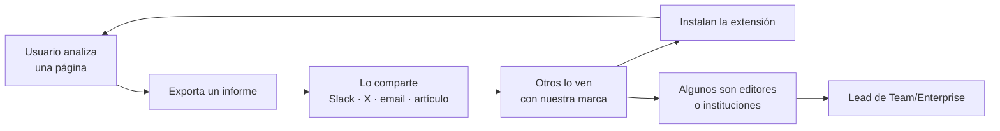

# 10 · Estrategia de monetización

## 1. Dónde está realmente el valor

La intuición es cobrar por el veredicto. Es la intuición equivocada: el veredicto es el
componente que más rápido se comoditiza y el que peor se sostiene científicamente
(ver [`07-riesgos-tecnicos.md`](./07-riesgos-tecnicos.md#r-01--la-exactitud-del-detector-no-sobrevive-al-mundo-real--p5-i5)).

Se cobra por cuatro cosas que sí resisten:

1. **Profundidad** — analizar más, más a fondo, más formatos.
2. **Prueba** — convertir señales en un documento defendible ante un tercero.
3. **Control** — política, despliegue y auditoría a escala de organización.
4. **Integración** — que el motor funcione dentro del producto de otro.

Los cuatro escalan con el valor que el cliente extrae, no con nuestro coste marginal, que es
prácticamente cero porque la inferencia corre en el dispositivo del usuario. **La estructura de
costes es la mejor de la categoría**: los competidores en la nube pagan GPU por cada análisis;
nosotros pagamos CDN.

---

## 2. Planes

| | **Free** | **Pro** | **Team** | **Enterprise** |
|---|---|---|---|---|
| Precio | 0 | 9 USD/mes · 90/año | 15 USD/usuario/mes | Desde 25.000 USD/año |
| Análisis de texto | Tier 0 + Tier 1 | + Tier 2 | + Tier 2 | + modelos propios |
| Análisis de imagen | Procedencia + Tier 1 | + saliencia y XAI | idem | idem |
| Páginas al día | Ilimitado | Ilimitado | Ilimitado | Ilimitado |
| Historial | 7 días | Ilimitado | Ilimitado | Ilimitado + retención por política |
| Informes exportables | 3 al mes, con marca | Ilimitados, sin marca | Ilimitados + plantillas | + firma y cadena de custodia |
| PDF y documentos | — | Sí | Sí | Sí |
| Vídeo (fotogramas) | — | Sí | Sí | Sí |
| Motor de reglas | 3 reglas | Ilimitadas | Compartidas por equipo | Política central |
| Multimodal cruzado | — | Sí | Sí | Sí |
| Panel administrativo | — | — | Básico | Completo, SSO/SAML, SCIM |
| Despliegue centralizado | — | — | — | Sí, MDM/GPO |
| Registro de modelos on-prem | — | — | — | Sí |
| Auditoría | — | — | Básica | Completa, exportable |
| API | — | 1.000 llamadas/mes | 10.000/mes | Contractual |
| SDK | — | — | — | Sí, con licencia |
| Soporte | Comunidad | Email | Prioritario | SLA + CSM |

### 2.1 El plan gratuito no está lisiado

Regla explícita: **Free debe ser el mejor producto gratuito de la categoría, sin trampas.** Sin
límite de páginas, sin marca de agua en el overlay, sin cuenta obligatoria, sin caducidad. Un
usuario gratuito puede usarlo durante años y estar mejor servido que con cualquier alternativa
de pago de la competencia.

El motivo no es generosidad. Es que la distribución es el activo, y un free tier mutilado destruye
la distribución para capturar un porcentaje ínfimo de conversión adicional. El límite de Free no
es la *cantidad* sino la *profundidad y la prueba*: Tier 2, informes sin marca y formatos
adicionales. Quien los necesita, los necesita de verdad.

### 2.2 Por qué 9 USD

Por debajo de GPTZero y Originality (~15 USD), que es el punto de comparación que el usuario hará.
Suficiente para que el LTV soporte la adquisición de pago si alguna vez hace falta. Y con coste
marginal casi nulo, el margen bruto está por encima del 90 % incluso con conversión baja.

---

## 3. API y SDK

Donde está el negocio grande, aunque no el volumen inicial.

**API** (V1.5). El kernel envuelto en un servicio HTTP. Precio por análisis con tramos por
volumen. Compradores: plataformas de contenido, mercados que necesitan filtrar envíos generados,
herramientas de moderación, plataformas educativas.

**SDK** (V2). El kernel como paquete npm y como binding WASM, ejecutándose **en la
infraestructura del cliente o en el navegador de sus usuarios**. Licencia anual más soporte.

El SDK es estratégicamente superior a la API por la misma razón que el producto es local: un
cliente que no puede enviarnos su contenido —una plataforma sanitaria, una legal, un gobierno— no
puede comprar la API de nadie, pero sí puede comprar el SDK. Ese segmento está desatendido por
completo hoy porque toda la competencia es SaaS en la nube.

Que ambos existan sin reescritura es consecuencia directa de la decisión de arquitectura del
kernel puro. Esa decisión vale más que cualquier funcionalidad del roadmap.

---

## 4. Product Led Growth

### 4.1 Bucle principal: el Informe de Confianza

Cada informe exportado en Free lleva marca y enlace. Es el único uso de marca en el producto y
está justificado: el informe se creó para ser compartido. Quitar la marca es una de las razones
concretas para pagar Pro, que es la forma correcta de monetizar un bucle viral: **quien más valor
extrae del bucle es quien más quiere quitarle la marca.**

### 4.2 Momento de conversión

La conversión no se fuerza con muros. Se ofrece exactamente cuando el usuario topa con el límite
de forma natural:

| Momento | Oferta |
|---|---|
| Tier 1 no concluye y hay desacuerdo entre detectores | "Análisis profundo disponible en Pro" |
| Cuarto informe del mes | "Informes ilimitados y sin marca" |
| Intenta analizar un PDF | "Documentos en Pro" |
| Crea la cuarta regla | "Reglas ilimitadas" |
| Consulta historial de hace más de 7 días | "Historial completo" |

Nunca un modal al instalar. Nunca una cuenta obligatoria para usar el producto.

### 4.3 De Pro a Team a Enterprise

La expansión llega desde dentro: un periodista de una redacción usa Pro, el equipo lo adopta, el
medio pide facturación única y política común. Se instrumenta con detección de dominio de correo
corporativo y un flujo de "invitar a mi equipo" sin fricción.

---

## 5. Verticales de alto valor

| Vertical | Problema | Plan | Por qué gana XplagiaX |
|---|---|---|---|
| **Periodismo y verificación** | Verificar material sin subirlo a un tercero | Pro / Team | Local. Es un requisito de la profesión, no una preferencia |
| **Legal y peritaje** | Evidencia con cadena de custodia | Enterprise | Informes firmados, procesamiento local, auditoría |
| **Educación** | Necesitan la señal, no pueden usar detectores injustos | Team | Abstención y equidad medida son la propuesta entera |
| **Marketplaces y UGC** | Filtrar envíos generados a escala | API | Coste por análisis y latencia |
| **Editoriales y medios** | Auditar contenido de colaboradores | Team | Flujo de trabajo, no puntuación suelta |
| **Sector público** | Verificación con soberanía del dato | Enterprise + SDK | On-prem, sin nube |

El vertical educativo merece una nota: es el que la categoría ha quemado. Entrar ahí requiere
liderar con la crítica a los detectores —incluida la nuestra— y vender "informe de señales para
una conversación", nunca "detector de trampas". Es un ciclo de venta más largo y un mercado con
menos competencia de la que había hace dos años, porque los incumbentes fueron expulsados.

---

## 6. Modelo económico, orden de magnitud

Supuestos deliberadamente conservadores para el año 2 tras el lanzamiento:

| Variable | Valor | Comentario |
|---|---|---|
| Instalaciones activas | 500.000 | Alcanzable con distribución en 5 tiendas y bucle de informes |
| Conversión a Pro | 2 % | Rango bajo para PLG con free tier fuerte |
| Suscriptores Pro | 10.000 | |
| ARR Pro | ~1,0 M USD | A 90 USD/año |
| Cuentas Team | 300 × 8 usuarios | |
| ARR Team | ~4,3 M USD | |
| Contratos Enterprise | 12 | |
| ARR Enterprise | ~0,4 M USD | Precio inicial conservador |
| API/SDK | ~0,5 M USD | |
| **ARR total** | **~6,2 M USD** | |
| Margen bruto | > 90 % | Inferencia en el dispositivo del usuario |

Lo relevante no es la cifra sino la forma: **el margen bruto y la ausencia de coste de inferencia
son estructurales**, no fruto de optimización. Un competidor en la nube con el mismo ARR gasta en
GPU un porcentaje de ingresos que nosotros no gastamos, y esa diferencia se reinvierte en
distribución.

El camino a valoración de mil millones no pasa por multiplicar suscriptores de 9 USD. Pasa por que
el SDK se convierta en la capa que otros integran —el trayecto de Stripe, Twilio o Plaid en sus
categorías— y por que el corpus de reputación de dominios sea el registro de referencia que se
cita. La extensión es el canal de distribución y la prueba pública de que la tecnología funciona;
no es el negocio final.

---

## 7. Lo que no se hará

- **Publicidad**: incompatible con la promesa de privacidad. No es negociable.
- **Vender datos agregados**: aunque fueran anónimos, contradice el compromiso público.
- **Freemium con muro de cuenta**: pedir email antes de aportar valor mata la activación.
- **Cobrar por precisión**: "más exactitud en el plan Pro" implicaría que el gratuito es
  deliberadamente peor en la dimensión que puede dañar a una persona. Todos los planes usan la
  misma calibración y las mismas reglas de abstención. Pro analiza **más**, no **mejor**.
