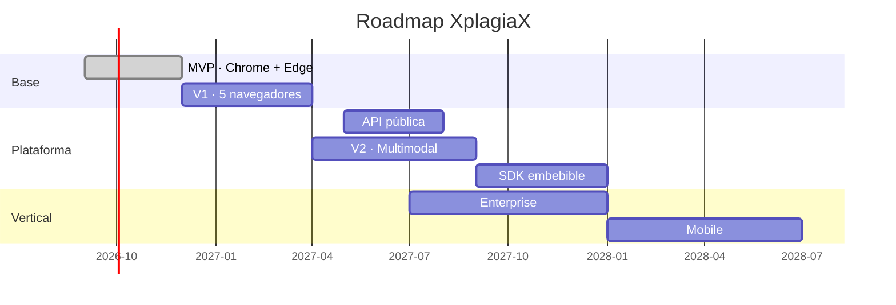

# 12 · Roadmap

Cubre los entregables 12 a 17 del brief: V1, V2, Enterprise, Mobile, API y SDK.

Cada fase tiene una **puerta de entrada**: una condición medible sin la cual la fase no empieza,
aunque el calendario diga que toca. La función de las puertas es impedir que el roadmap se
ejecute por inercia.

---

## Vista general

---

## V1 · Producto completo multi-navegador

**Puerta de entrada:** MVP con retención D30 ≥ 25 % y H2 (rendimiento) confirmada.
**Duración:** 4 meses.

### Objetivo
Pasar de una prueba en dos navegadores a un producto comercial en cinco, con la primera
monetización.

### Alcance

**Navegadores.** Firefox (event pages, `RuntimeHost` propio) → Opera (mismo artefacto Chromium,
tienda distinta) → Safari (proyecto Xcode, app contenedora, App Store). Safari es el último por
coste, no por prioridad estratégica.

**Detección.**
- Clasificador de imagen Tier 1 con saliency maps, siguiendo el enfoque de DejAIvu: ONNX Runtime
  Web con explicabilidad por gradientes.
- Tier 2 de texto opt-in: Gemma-270M vía wllama, o el motor zero-shot que gane el banco de
  pruebas ([ADR-005](./adr/ADR-005-motor-tier2.md)).
- Segundo motor de texto independiente para reducir error correlacionado.
- Idiomas validados: inglés, español, portugués, francés, alemán.

**Producto.**
- Cuentas, pagos y plan Pro.
- Informes exportables sin marca, con plantillas.
- Motor de reglas: umbrales, dominios, acciones.
- Análisis bajo demanda de PDF y documentos.
- Dashboard completo: historial, gráficos, dominios, exportación.
- Alertas configurables por umbral.
- AI Trust Score por página combinando texto, imagen y metadatos.
- Mapa de confianza visual de la página.
- Sistema de feedback: marcar falso positivo, con envío opcional del ejemplo.

**Fundamentos.**
- Recalibración continua con el feedback recibido.
- Feature flags con despliegue por porcentaje.
- Auditoría de seguridad externa publicada.
- Página pública de metodología con la matriz de rendimiento por idioma y dominio.

### Criterios de salida
5 navegadores publicados · 100.000 instalaciones activas · conversión a Pro ≥ 1,5 % ·
FPR y equidad dentro de objetivo en los 5 idiomas · auditoría publicada.

---

## API pública

**Puerta de entrada:** kernel estable durante 2 releases sin cambios incompatibles, y al menos 5
solicitudes entrantes no provocadas de acceso programático.
**Duración:** 3 meses. Se solapa con V1 a propósito: el kernel ya existe, es trabajo de envoltura.

### Alcance
- `POST /v1/analyze` — texto, imagen o URL. Devuelve el objeto `Evidence[]` completo, no un número.
- `POST /v1/analyze/batch` — asíncrono con webhook.
- `GET /v1/methodology` — calibración vigente, idiomas validados, versiones de modelo. Público y
  sin autenticación: la transparencia es parte del producto.
- Claves, cuotas, límite de tasa, panel de uso.
- SDKs cliente en TypeScript y Python.
- Precio por análisis con tramos.

### Compromisos de diseño
La API devuelve **la misma estructura de evidencia** que la extensión, incluida la abstención. Un
integrador que quiera un booleano tendrá que decidir él el umbral, y la documentación le explicará
por qué esa decisión es suya y no nuestra.

**Nunca se registra el contenido enviado.** Se procesa en memoria y se descarta. Auditable, y es
la razón por la que un cliente sensible elegiría esta API sobre las existentes.

### Criterios de salida
20 clientes de pago · p95 < 400 ms para texto Tier 1 · disponibilidad 99,9 %.

---

## V2 · Multimodal y análisis profundo

**Puerta de entrada:** V1 completo, 250.000 instalaciones, ARR ≥ 1 M USD.
**Duración:** 5 meses.

### Alcance

**Nuevas modalidades.**
- **Vídeo** por extracción de fotogramas, con muestreo adaptativo y análisis en OffscreenCanvas.
  Solo bajo demanda; el coste computacional lo hace inviable como automático.
- **Correo web y redes sociales**, bajo demanda explícita. Nunca automático, por muy amplio que
  sea el permiso: es la categoría de contenido más sensible que existe.
- **Documentos**: PDF, DOCX, texto plano, con extracción local.

**Análisis cruzado.**
- **Detección multimodal**: correlacionar texto e imagen para detectar inconsistencias (una imagen
  que no corresponde al texto, un pie de foto generado sobre una foto real).
- **Timeline de cambios**: comparar versiones de una página en el tiempo y detectar si el
  contenido generado se añadió después. Requiere instantáneas locales; se implementa solo con
  contenido que el usuario haya marcado para seguimiento, nunca de forma pasiva.
- **Detección de manipulación**: rostros sintéticos y edición facial. Voces clonadas queda para
  V3 — requiere pipeline de audio completo y su propio corpus.

**Ecosistema.**
- **Arquitectura de plugins** abierta: manifiesto firmado, sandbox de Worker, permisos declarados
  por plugin. La interfaz `Detector` ya existe desde el MVP; V2 añade el empaquetado, la firma y
  el aislamiento.
- **Reputación de dominios** construida con rastreador propio, con metodología publicada y derecho
  de réplica (ver [`09-riesgos-privacidad.md`](./09-riesgos-privacidad.md#5-reputación-de-dominios-sin-vigilar-a-nadie)).
- **A/B testing de modelos** en producción con feature flags.

**Modos verticales.**
- Modo periodista: informes con cadena de evidencias, exportables y citables.
- Modo académico: informe de señales para conversación docente-estudiante, con lenguaje diseñado
  para no acusar y prohibición contractual de uso sancionador único.

### Criterios de salida
3 modalidades nuevas en producción · marketplace con 10 plugins de terceros · reputación de
dominios con más de 100.000 dominios muestreados y metodología publicada.

---

## SDK embebible

**Puerta de entrada:** API con 20 clientes y al menos 3 que pidan ejecución en su propia
infraestructura.
**Duración:** 4 meses.

### Por qué importa más que la API
Un cliente que no puede enviar contenido a un tercero —salud, legal, gobierno, banca— no puede
comprar la API de nadie, incluida la nuestra. Sí puede comprar el SDK. Ese segmento está
completamente desatendido porque toda la competencia es SaaS en la nube. Es el movimiento con
mayor potencial de convertir el producto en infraestructura.

### Alcance
- `@xplagiax/kernel` en npm: el kernel, sin cambios, con adaptadores documentados.
- Binding WASM para consumo desde otros lenguajes.
- Runner de servidor autoalojado, en contenedor.
- Registro de modelos privado para clientes que quieran modelos propios.
- Licencia comercial anual con soporte y actualizaciones de modelo.
- Documentación de integración, plantillas de referencia y suite de conformidad para que un
  integrador verifique que su despliegue reproduce nuestra calibración.

### Criterios de salida
5 clientes con SDK en producción · ACV medio ≥ 50.000 USD.

---

## Enterprise

**Puerta de entrada:** 3 organizaciones con más de 50 usuarios de Pro pidiendo facturación y
control central.
**Duración:** 6 meses, solapado con V2.

### Alcance
- Panel administrativo: usuarios, política, uso, cumplimiento.
- Despliegue centralizado por MDM, GPO y `managed_schema`.
- SSO/SAML y aprovisionamiento SCIM.
- Política corporativa: umbrales, exclusiones, modalidades permitidas, retención.
- Registro de auditoría exportable a SIEM.
- Registro de modelos on-prem y despliegue en red aislada.
- Modo completamente sin conexión, sin ninguna llamada saliente.
- SLA, gestor de cuenta, soporte prioritario.

### La línea que no se cruza
El administrador controla la **configuración**, no la **vigilancia**. No existe, ni existirá, una
opción que envíe contenido de los empleados a ningún destino. Si un cliente lo exige como
condición, se pierde el cliente. Está escrito en la documentación comercial precisamente para que
la conversación ocurra antes de la firma y no después.

### Criterios de salida
12 contratos · ACV medio ≥ 25.000 USD · certificación SOC 2 Tipo II en curso.

---

## Mobile

**Puerta de entrada:** V2 estable y demanda medida en encuestas de usuarios activos.
**Duración:** 6 meses.

### La realidad técnica
Móvil no es un puerto: es un producto distinto.

| Plataforma | Vía | Viabilidad |
|---|---|---|
| **Android** | Firefox for Android soporta extensiones; Kiwi y similares | Alta. El artefacto existente casi funciona |
| **iOS** | Safari Web Extensions en iOS | Media. Restricciones de memoria y de background severas |
| **App nativa** | Share sheet: analizar lo compartido | **La mejor vía en ambas plataformas** |

Recomendación del consejo: **la app nativa con integración en la hoja de compartir es el producto
móvil**, no la extensión. El gesto natural en móvil es "compartir esta imagen con XplagiaX", no
"navegar con una extensión activa". Además esquiva las limitaciones de memoria y de ejecución en
segundo plano que harían inviable Tier 1 dentro de una extensión móvil.

### Alcance
- App iOS y Android con extensión de compartir.
- Tier 0 completo y Tier 1 con modelos cuantizados para móvil (Core ML y NNAPI vía ONNX Runtime
  Mobile).
- Extensión para Firefox Android reutilizando el artefacto de escritorio.
- Sincronización de historial cifrada extremo a extremo, opcional.

### Criterios de salida
Apps publicadas · 50.000 instalaciones · paridad de Tier 0 con escritorio.

---

## Resumen de puertas

| Fase | No empieza hasta que… |
|---|---|
| V1 | Retención D30 ≥ 25 % y rendimiento confirmado |
| API | Kernel estable 2 releases + 5 peticiones entrantes |
| V2 | 250.000 instalaciones y ARR ≥ 1 M USD |
| SDK | 20 clientes de API, 3 pidiendo on-prem |
| Enterprise | 3 organizaciones pidiendo control central |
| Mobile | V2 estable y demanda medida |

Ninguna puerta se abre por calendario. Si una fase no cumple su puerta, la respuesta correcta es
mejorar la fase anterior, no empezar la siguiente. La causa más común de muerte en productos con
roadmaps ambiciosos es ejecutar la fase 4 con la fase 2 sin validar.
